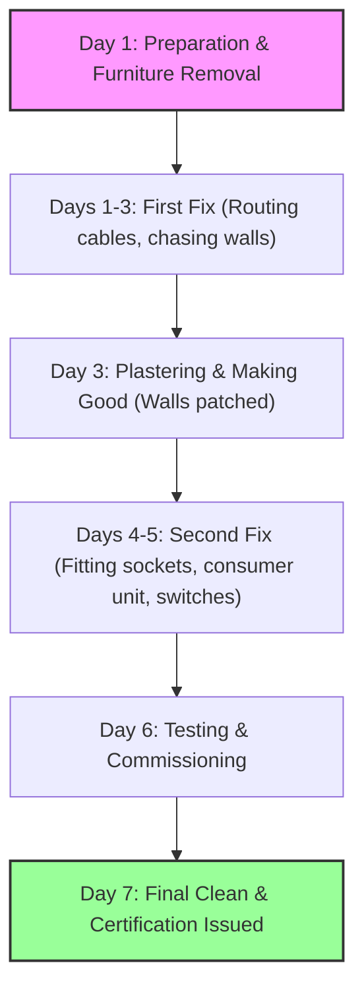

# House Rewiring Cost UK: 2025/26 Price Guide for 2, 3 & 4 Bed Homes

**Quick answer:** A full house rewire in the UK typically costs between **£3,800 and £6,200** for an average 3-bedroom semi-detached home. Smaller 2-bedroom homes range from **£3,000 to £5,000**, while larger 4-bedroom detached houses cost between **£6,000 and £9,000+**. Prices vary based on house size, location, accessibility, and the number of electrical outlets required. Rewiring is not a DIY task; it must be completed and certified by a registered, qualified electrician to comply with UK Part P Building Regulations.

Rewiring a house is one of the most significant, disruptive, and essential home improvements you can undertake. While a new kitchen or bathroom offers an instant visual upgrade, a complete electrical overhaul sits behind the scenes, keeping your family safe and your home functional. 

If you are planning a renovation, buying an older property, or simply noticing your sockets showing signs of wear, this guide breaks down the average cost to rewire a house UK, the key signs you need a rewire, and what the process involves.

---

## How much does it cost to rewire a home in the UK?

The overall house rewiring cost UK depends largely on the size of the property and the complexity of the installation. For a standard domestic rewire, VAT of 20% is usually charged by VAT-registered tradespeople. 

Outside of London and the South East, the average hourly rate for a qualified electrician ranges between **£40 and £60 per hour**. However, full house rewires are rarely billed by the hour. Instead, electricians work on a fixed day rate or a complete project fee. A team of two electricians will typically cost **£300 to £500 per day** in labour.

---

## Cost table by house size (2, 3, 4 bed)

To help you budget, here is a breakdown of the typical costs, project durations, and materials needed for a full rewire. These estimates include a new consumer unit, wiring, standard white sockets and switches, labour, and waste disposal.

| Property Size | Typical Cost Range (Excl. VAT) | Typical Cost Range (Inc. 20% VAT) | Est. Project Duration | Typical Number of Sockets & Outlets |
| :--- | :--- | :--- | :--- | :--- |
| **2-Bed Terrace / Flat** | £2,500 – £4,150 | £3,000 – £5,000 | 3 – 5 Days | 25 – 35 |
| **3-Bed Semi-Detached** | £3,150 – £5,150 | £3,800 – £6,200 | 5 – 7 Days | 35 – 50 |
| **4-Bed Detached** | £5,000 – £7,500 | £6,000 – £9,000 | 7 – 10 Days | 50 – 70 |
| **5-Bed+ Detached** | £7,000 – £10,000+ | £8,400 – £12,000+ | 10 – 14 Days | 70+ |

*Note: These ranges represent national averages for 2025/26. Prices in London and the South East will be significantly higher.*

---

## Rewire cost calculator – how to estimate your own

While generic cost calculators online offer a basic overview, you can create a more realistic DIY estimate by understanding how electricians price their work. Electricians calculate costs based on the number of "points" (sockets, light switches, cooker switches, and light fittings) and the cost of the main components.

A rough formula to estimate your own rewiring costs is:

**Estimated Cost = (Number of Points x Cost per Point) + Consumer Unit Cost + Labour Days Rate + VAT**

*   **Cost per Point:** On average, electricians charge **£60 to £95 per point** (including cable routing and faceplates).
*   **Consumer Unit Upgrade:** Replacing a fuse box with a modern metal consumer unit containing RCDs or RCBOs typically costs **£400 to £800** on its own.
*   **Labour:** Budget around **£400 per day** for an electrician and apprentice team.
*   **VAT:** Add 20% if the electrician is VAT-registered.

Using this cost of rewiring a 3 bedroom house UK calculator method: for a home needing 45 points, 45 points × £80 = £3,600. Add £500 for a new consumer unit, bringing the subtotal to £4,100. Adding VAT at 20% (£820) results in a total estimate of £4,920.

---

## What factors affect rewiring cost?

No two properties are identical, and several factors can drive your final quote up or down:

*   **Property Occupancy:** It is much faster and cheaper to rewire an empty property. If the electrician has to move furniture, protect carpets, and make the circuits safe at the end of every day so you can live there, expect labour costs to increase by **15% to 25%**.
*   **Access and Construction:** Routing cables through timber joists and plasterboard walls is straightforward. Routing through concrete floors or solid brick walls requires "chasing" (cutting grooves into the wall), which is physically demanding and time-consuming.
*   **Fittings and Finishes:** Standard white plastic faceplates are included in basic quotes. Upgrading to brushed steel, chrome, copper, or smart-home switches can add hundreds of pounds to your material bill.
*   **Location:** Rates vary widely across the UK. London and the South East are **20% to 30% more expensive** than the national average, whereas parts of the North and Scotland can be **10% to 15% cheaper**.

---

## When do you need to rewire a house? (signs checklist)

Electrical cables degrade over time. If your property has not had electrical work done in the last 25 to 30 years, it is likely due for an inspection. Most homes built after 1990 do not require a full rewire unless the cabling has been damaged or altered unsafely.

Look out for key signs you need a rewire:

*   **Frequent Tripping:** The fuse box or consumer unit trips regularly, cutting off your electricity.
*   **Flickering or Dimming Lights:** Lights dim or flicker when you turn on other appliances.
*   **Old Cabling:** You can see black rubber-insulated cabling (pre-1960s) or lead-sheathed cabling. These are dangerous and must be replaced. Modern cabling is insulated in grey or white PVC.
*   **Green Sludge (Plasticiser):** A green, sticky liquid leaking from sockets or switches. This is a chemical reaction in older PVC cables that can cause tracking and fire risks.
*   **No Earth Wiring:** Older light circuits often lack an earth wire, meaning metal light switches or fittings could become live and deliver a shock.
*   **Fuses Instead of Circuit Breakers:** An old-style wooden fuse box with wire fuses rather than a modern consumer unit with flick-switches.
*   **Burning Smells or Scorched Sockets:** Brown scorch marks around socket holes or a warm, fishy smell near outlets or the fuse box.

---

## Full rewire vs partial rewire – which do you need?

If your budget is tight, you might wonder if a partial rewire cost UK is a viable alternative to a full system replacement.

*   **Full Rewire:** Replaces all cabling, sockets, switches, and the consumer unit throughout the entire property. This is highly recommended as it ensures the entire system is modern, uniform, and fully certified.
*   **Partial Rewire:** Focuses on upgrading specific sections of the house—such as rewiring a newly built extension, a damp basement, or the kitchen only. While a partial rewire keeps costs down initially, it means you will have two systems of differing ages, which can complicate future maintenance and certification.

---

## What is included in a full house rewire?

When comparing quotes from different electricians, ensure they include the following:

1.  **First Fix:** Routing all new cables through walls, floors, and ceilings. This involves lifting floorboards and chasing channels into walls.
2.  **Second Fix:** Installing the consumer unit (fuse box), fitting socket plates, light switches, light fittings, and connecting appliances.
3.  **Removal of Old Wiring:** Disconnecting and, where possible, removing the old cables and accessories.
4.  **Testing and Certification:** Verifying the safety of the entire installation using specialist testing equipment.
5.  **Building Regulations Notification:** Notifying Local Authority Building Control of the work.

---

## What is not included (making good, plastering, decorating)

A common shock for homeowners is the state of the property after a rewire. Electricians are responsible for installing the cables and fittings, not for restoring your plaster or paintwork.

Rewiring requires cutting deep channels into plaster walls to run cables. While electricians will patch holes roughly or fit plastic capping, they do not offer professional plastering. 

*   **Plastering Costs:** Budget an additional **£800 to £2,000** for a plasterer to "make good" the chased walls before you can redecorate.
*   **Decorating:** You will need to paint or wallpaper the rooms after the plaster has dried.
*   **Floorboard Restoration:** If carpet or floorboards had to be lifted, you may need a carpet fitter or joiner to relay them correctly.

---

## How long does a full rewire take?

A typical 3-bedroom house rewire takes between **5 and 7 working days**. 

*   **Days 1–3:** lifting floors, chasing walls, and running the new cables (First Fix).
*   **Days 4–5:** installing the consumer unit, fitting sockets, switches, and lights (Second Fix).
*   **Days 6–7:** testing the circuits, cleaning up, and issuing certificates.

For a small flat or 2-bedroom home, a team of two electricians might complete the work in **3 days**. A large, occupied 4 or 5-bedroom home with complex routing could take up to **2 weeks**.

---

## Regional price differences (London, South East, North, Scotland)

Labour rates vary significantly across the UK. Here is how regional differences affect the cost of rewiring a 3 bedroom house UK:

*   **London & South East:** Expect to pay **£4,800 to £8,000** due to higher overheads and daily rates.
*   **Midlands & South West:** Reflects the national average of **£3,800 to £6,200**.
*   **North of England & Yorkshire:** Typically **10% to 15% lower**, ranging from **£3,400 to £5,300**.
*   **Scotland & Wales:** Often **10% lower**, ranging from **£3,450 to £5,500**.

---

## Do I need Building Regulations approval? (Part P explained)

In England and Wales, domestic electrical installations are governed by **Part P of the Building Regulations**. This law states that major electrical work, including a full or partial rewire, is "notifiable" to local building control.

To comply with the law, your installer must be registered with a government-approved competent person scheme, such as:

*   **NICEIC** (National Inspection Council for Electrical Installation Contracting)
*   **NAPIT** (National Association of Professional Inspectors and Testers)

Once the work is complete, your registered electrician will test the system and issue two crucial documents:
1.  An **Electrical Installation Certificate (EIC)**.
2.  A **Building Regulations Compliance Certificate** (sent to you within 30 days of the work completing).

If you hire an unregistered electrician, you must pay Local Authority Building Control to inspect and sign off the work directly, which costs hundreds of pounds and delays the project.

---

## Can I rewire a house myself?

No. You should never attempt to rewire a home yourself. Domestic electrical systems carry lethal voltages. Modern safety regulations are strict, and incorrect wiring is a major cause of house fires and electrical shocks.

Legally, you cannot self-certify electrical work under Part P regulations unless you are registered. If you carry out DIY rewiring, you will not have the necessary compliance certificates. This will prevent you from selling your property in the future and could invalidate your home insurance policy.

---

## How to find a registered electrician (NICEIC, NAPIT)

To find a competent, registered electrician in your area:

1.  **Check Registries:** Use the official **Registered Competent Person Electrical** database (electricalcompetentperson.co.uk) to verify registration.
2.  **Trade Directories:** Search platforms like Checkatrade, MyBuilder, or Which? Trusted Traders, looking for firms with strong local reviews and verified credentials.
3.  **Personal Recommendations:** Ask friends, family, or neighbours who have recently had electrical work done.

---

## Questions to ask before hiring

Always obtain at least three written quotes, and ask each contractor the following questions:

*   Are you registered with a competent person scheme like NICEIC or NAPIT?
*   Will you provide an Electrical Installation Certificate (EIC) and register the work with building control?
*   Does your quote include the cost of the new consumer unit and waste disposal?
*   Are you insured, and what public liability cover do you hold?
*   Will you be working in a team, and how long do you expect the job to take?
*   Does the quote include "making good" the plaster, or will I need to hire a plasterer?
*   Is the price inclusive of VAT?

---

## Does rewiring add value to a home?

Rewiring does not typically add a direct premium to your house's market price in the way an extension does. Instead, it **preserves the home's value and prevents depreciation**. 

If a surveyor inspects your property for a buyer and finds outdated or unsafe wiring, the buyer will likely demand a price reduction of £4,000 to £8,000 to cover the cost of a future rewire. Having a clean, certified electrical system makes your property much easier to sell.

---

## Does home insurance require rewiring?

Most home insurance policies do not explicitly state that you must rewire your home. However, you are contractually obligated to maintain your property in a safe, habitable condition. 

If your home has pre-1970s wiring, your insurer may ask about the electrical system's age. If a fire occurs due to outdated, faulty wiring that you knew was unsafe, the insurer may refuse to pay out. Always check your policy wording and declare the true state of your electrics.

---

## Hidden costs to watch for

When budgeting, keep these potential hidden costs in mind:

*   **Asbestos Testing:** In homes built before 2000, cutting into textured ceilings (like Artex) or walls can release asbestos fibres. An asbestos survey or sample test costs **£50 to £200**.
*   **Routing Through Solid Floors:** Ground floor flats with concrete subfloors can be difficult to wire, requiring expensive wall chasing or surface-mounted trunking.
*   **Energy Efficiency Upgrades:** If your home is being rewired, it is the best time to add cables for an **EV charger** or **solar panel battery storage**, which will add to the initial materials bill.
*   **Lifting and Replacing Carpets:** Electricians will lift carpets to access floorboards, but they do not guarantee they will lay them back down perfectly.

---

## Simple timeline of a full rewire

Planning ahead can reduce the stress of a rewire. Here is the typical sequence:

1.  **Preparation (Before start):** Pack away valuables and clear furniture from walls.
2.  **First Fix (Days 1–3):** Electricians lift floorboards and cut grooves in walls to run cables. Expect high levels of noise and dust.
3.  **Plastering (Day 3–4):** Wall chases are patched and allowed to dry.
4.  **Second Fix (Days 4–5):** Electricians fit the consumer unit, sockets, switches, and lights.
5.  **Testing and Clean Up (Day 6):** Circuits are tested, power is restored, and the house is cleaned.
6.  **Certification (Day 7):** Electrician issues your EIC.

---

## Common mistakes

*   **Rewiring after decorating:** Never paint or wallpaper a room before rewiring. Chasing cables will ruin the walls. Always schedule **rewiring a house before plastering** and decorating.
*   **Not planning socket locations:** Take the time to map out where your TV, bed, and kitchen appliances will go. Adding sockets later is expensive and messy.
*   **Failing to get certificates:** Do not make the final payment until you have received the Electrical Installation Certificate (EIC). You will need this document when selling the house.
*   **Hiring unregistered tradespeople:** Hashing together a rewire with an unregistered electrician to save money will cost you more when building control forces a reinstall or re-inspection.

---

## People Also Ask

### How much to rewire a 3 bed house UK?
Rewiring a typical 3-bedroom house in the UK costs between £3,800 and £6,200 including VAT. This includes a new consumer unit, cabling, standard fittings, labour, and testing.

### When does a house need rewiring?
A house generally needs rewiring if the electrical installation is over 25–30 years old, or if you spot signs of damage such as frequent circuit trips, flickering lights, green sludge on sockets, or rubber insulated cabling.

### Can I rewire a house myself?
No. UK building regulations require major electrical works to be certified under Part P. Rewiring is dangerous, complex, and requires specialist test equipment to certify.

### How long does a full rewire take?
A full house rewire takes between 3 and 10 days depending on property size, layout, accessibility, and whether the home is occupied during the work.

### Does rewiring add value to a home?
It preserves the property's market value by ensuring it passes building surveys. Buyers will often renegotiate the asking price down if the property needs a rewire.

### Is rewiring covered by home insurance?
No. General maintenance, wear and tear, and planned upgrades like rewiring are not covered by standard home insurance policies.

---

## People Also Search For

### Cost of rewiring a 3 bedroom house UK
The typical cost of rewiring a 3 bedroom house UK ranges from £3,800 to £6,200. This is the most common size of property rewired in the UK.

### Rewire cost calculator
A rewire cost calculator uses variables like the number of rooms, electrical points, and regional labour rates to estimate overall costs before hiring an electrician.

### How much to rewire a 2 bed house
The average cost to rewire a 2 bed house is between £3,000 and £5,000, taking roughly 3 to 5 days to complete.

### Signs you need a rewire
Key signs you need a rewire include old wooden fuse boxes, black rubber cabling, green sticky sludge, flickering lights, and burning smells near sockets.

### Full house rewire cost UK
The average full house rewire cost UK ranges from £3,000 for a small flat to over £9,000 for a large 4 or 5-bedroom home.

---

## FAQs

### Is VAT charged on electrical rewiring?
Yes. Electrical rewiring is subject to standard rate VAT at 20%. However, if the renovation work is carried out on a residential property that has been empty for at least two years, you may qualify for a reduced VAT rate of 5% under HMRC VAT Notice 708.

### Should I move out during a rewire?
If possible, yes. A rewire is extremely noisy, dusty, and requires lifting floorboards. The electricity will also be turned off for long periods. Moving out makes the work go faster and reduces stress.

### What is the difference between an RCD and a circuit breaker?
A circuit breaker protects your home's wiring from overloads and short circuits. An RCD (Residual Current Device) is a life-saving safety switch that cuts off the power in milliseconds if it detects a leakage of current, preventing electrical shocks.

### Can I choose my own socket faceplates?
Yes. You can buy your own decorative faceplates (such as metal or smart plates) and ask the electrician to fit them. This is usually done during the Second Fix. Discuss this with your electrician beforehand, as it may affect their warranty terms on materials.

---

## Bottom line

Rewiring a house is a significant investment, costing between £3,000 for a small flat and upwards of £9,000 for large homes. While the disruption and dust are substantial, the safety, compliance, and reliability of a modern system are invaluable.

Before starting your project, ensure you:
*   Identify the age and condition of your wiring.
*   Plan your socket layouts before any plastering or decorating begins.
*   Obtain at least three quotes from Part P registered electricians (NICEIC or NAPIT).
*   Verify that your quote includes a new consumer unit, testing, and final certification.

---

## Sources checked

*   **Electrical Safety First:** Guidance on domestic electrical safety, warning signs, and Part P regulations.
*   **NICEIC & NAPIT:** Competent person register databases and compliance requirements.
*   **HMRC VAT Notice 708:** Buildings and construction tax rates for empty properties and conversions.
*   **UK Building Regulations Approved Document P:** Electrical safety requirements for dwellings.
*   **Checkatrade & MyBuilder:** Domestic pricing surveys and trade rates for UK electricians (2025/26).
