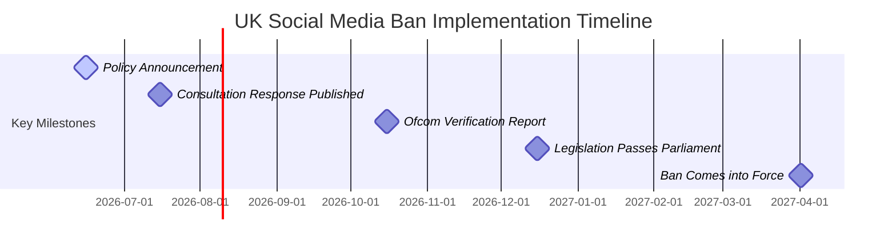

# UK Social Media Ban For Under-16s: What Parents Need To Know

**Quick answer:** The UK government has announced plans to ban children under 16 from accessing major social media platforms like TikTok, Instagram, Snapchat, and YouTube. Announced by Prime Minister Keir Starmer on 15 June 2026, the ban is expected to pass Parliament before Christmas 2026 and come into force in spring 2027. Messaging apps like WhatsApp are excluded, and enforcement will target tech firms with large fines, rather than punishing children or parents.

Technology and parenting are increasingly linked, and many parents are deeply concerned about the impact of screen time on their families. The UK government’s landmark announcement marks a major shift in how children will access the internet. 

Whether you are a busy parent trying to manage screen time, a teacher, or a guardian, this guide explains what the upcoming social media ban under 16 uk means, which apps are affected, and how the changes will work in practice.

---

## Quick answer: Has the UK banned social media for under-16s?

No, the ban is not in force yet. On 15 June 2026, Prime Minister Keir Starmer officially announced that the government intends to introduce legislation to block children under the age of 16 from major social media platforms. 

The regulation is scheduled to be debated and passed in Parliament before Christmas 2026, with the law taking full effect in spring 2027. Until then, current platform access rules remain unchanged.

---

## Which apps are banned? (full list)

The upcoming ban covers user-to-user platforms that feature public profiles, algorithmic feeds, and direct interactions between users. 

Under the proposed rules, children under 16 will be banned from accessing:

*   **TikTok**
*   **Instagram**
*   **Snapchat**
*   **YouTube** (standard version)
*   **Facebook**
*   **X (formerly Twitter)**
*   **Reddit**
*   **Twitch**
*   **Threads**
*   **Kick**

---

## Which apps are NOT banned? (WhatsApp, Signal, music streaming)

The UK government wants to keep communication channels open for families and teens, meaning private messaging services are excluded from the ban on social media under 16. 

The following services are **NOT** included in the ban:

*   **WhatsApp** (remains accessible for private messaging)
*   **Signal**
*   **Music Streaming Apps** (such as Spotify and Apple Music)
*   **Educational Platforms** (classroom tools used by schools)
*   **YouTube Kids** (specifically designed for younger children)

---

## When does the social media ban start? (timeline)

The government is moving quickly to pass the law, but implementation will take several months. Here is the official timeline:

*   **15 June 2026:** Prime Minister Keir Starmer announces the policy.
*   **July 2026:** The government publishes its full consultation response.
*   **October 2026:** Ofcom publishes its assessment of age-verification technologies.
*   **December 2026:** The legislation is expected to pass through Parliament.
*   **Spring 2027:** The social media ban officially comes into force.

---

## What did Keir Starmer announce?

Speaking at a Downing Street press conference on 15 June 2026, Keir Starmer outlined his vision for a safer digital environment. The Prime Minister stated: "I am not prepared to compromise on the safety and happiness of our children." 

Starmer explained that the UK's policy is built on an "Australia Plus" model. While drawing inspiration from Australia's historic online restrictions, the UK plans to introduce tighter default privacy settings and block communication with strangers across gaming platforms for minors.

---

## How will the ban be enforced?

A common question from parents is whether children or parents will face legal penalties if a child slips through the net. 

The government has clarified that **enforcement is the sole responsibility of the tech companies**, not families:

*   **No Fines for Families:** Children will not be fined, and parents will not face prosecution if their child accesses social media.
*   **Fines for Tech Companies:** Ofcom, the UK communications regulator, will monitor the platforms. Tech firms that fail to block under-16s face significant financial penalties.
*   **Age Verification:** Social media platforms must implement robust age verification systems. While the exact methods are not yet finalised, Ofcom is assessing technologies such as facial age estimation and secure ID uploads, with a report due in October 2026.

---

## Is YouTube banned? Is YouTube social media?

Yes, standard YouTube is included in the ban. While many view YouTube as a video player rather than a social network, it is legally classified as a user-to-user platform. It hosts user-generated content, comments sections, direct messaging features, and algorithmic feeds that can keep children scrolling for hours.

However, the government is looking at exemptions for educational content. While standard YouTube will be restricted, services like **YouTube Kids** and educational tools used in schools will remain accessible.

---

## Is WhatsApp banned? Is WhatsApp social media?

No, WhatsApp is not banned. The UK government classifies WhatsApp as a private messaging app rather than a social media network. 

Because it is used primarily for direct, private communication between family members and friends rather than broadcasting content to a public audience, it is excluded from the ban. Teenagers under 16 can continue to use WhatsApp to chat with friends and stay in contact with their parents.

---

## What about gaming and livestreaming?

The "Plus" in the UK's "Australia Plus" model introduces strict rules for video games. The government is targeting platforms where children can easily interact with adults they do not know.

Under the new rules:
*   **Stranger Communication Blocked:** Multi-player gaming platforms must disable direct voice and text communication between under-16s and adult players they are not friends with.
*   **Livestreaming Restrictions:** Under-16s will be blocked from accessing livestreaming feeds on gaming platforms where content is not pre-moderated.
*   **Default Settings for Older Teens:** These restrictions will also be turned on by default for 16- and 17-year-olds, though they will have the option to opt out.

---

## What can we learn from Australia's social media ban?

Australia introduced its social media ban on 10 December 2025. It serves as a testing ground for the UK's approach, showing both potential and limitations:

*   **The Successes:** In the first few weeks, Australian platforms deleted or blocked an estimated **4.7 million accounts** belonging to underage users. Tech firms faced potential fines of up to AUD $49.5 million for failing to comply, forcing them to take the rules seriously.
*   **The Gaps:** A survey conducted shortly after the Australian ban found that **78% of under-16s** still managed to access restricted platforms. Many used virtual private networks (VPNs), lied about their age, or used accounts set up by older friends. Furthermore, only one in three minors had successfully undergone facial scanning for verification.
*   **The UK's Goal:** The UK government has stated it is analyzing Australia's rollout to identify these enforcement gaps, aiming to create more robust verification methods before spring 2027.

---

## What do tech companies say?

The tech industry has reacted with caution, warning that blanket bans can sometimes create new problems:

*   **Meta** (owners of Instagram and Facebook) argued that bans risk isolating teenagers from positive online spaces and driving them toward unmoderated, less secure parts of the internet.
*   **YouTube** warned that a blanket restriction might push young people to "less safe services" that do not have the same safety controls as major platforms.
*   **Snapchat** claimed that disconnecting teenagers from private messaging with their peers "doesn't make them safer" and ignores the benefits of digital communication.

---

## What do bereaved families say? (Molly Russell context)

The campaign for online safety has been heavily influenced by bereaved families. The landmark Online Safety Act 2023 was driven in part by the family of Molly Russell, a schoolgirl who took her own life after viewing harmful content online.

*   **Past Criticism:** Ian Russell, Molly's father, has previously warned that simple bans can sometimes be "gesture politics" if they lack teeth or drive children underground.
*   **Current Reactions:** Following Keir Starmer's announcement on 15 June 2026, reaction from families was supportive. Lisa Kenevan, a bereaved mother who has campaigned for reform, praised the Prime Minister as a "human being" who had listened to parents' concerns. Ellen Roome, another campaigner, emphasized the need for "really strong age verification" to ensure the law works.

---

## What has not been confirmed yet?

While the policy direction is clear, several practical details are still being worked out:

*   **The Verification Method:** The government has not decided whether platforms must use facial estimation, ID uploads, or third-party verification services. Ofcom will advise on this in October 2026.
*   **Existing Accounts:** It is not yet clear whether under-16s who already have accounts will have them deleted automatically in spring 2027, or if there will be a transition phase.
*   **Features for Older Teens:** Proposals for overnight curfews or mandatory breaks from infinite scrolling for 16- and 17-year-olds are being assessed, with details expected in the July 2026 consultation response.
*   **UK Fine Structure:** The exact maximum fine amount for UK non-compliance has not been set, though it is expected to align with the large penalties seen in Australia.

---

## Why is the government doing this now?

The decision follows a massive public consultation that drew more than **116,000 responses** from parents, children, and experts. 

The feedback showed a clear consensus:
*   **85% of parents** believe the risks of social media to children's mental health outweigh any benefits.
*   **91% of parents** support raising the minimum age for these platforms to 16.
*   **Two-thirds of young people** agree that younger teens should not have access to certain social media services.

Additionally, Ofcom data from May 2026 revealed that **84% of children aged 8 to 12** still use at least one platform with a minimum age of 13, showing that existing self-regulation by tech firms has failed.

---

## Simple timeline of events

Here is the path from today's announcement to the implementation of the law:

---

## Common misunderstandings

*   **Misunderstanding: "WhatsApp is getting banned."**
    *   *Reality:* WhatsApp and other private messaging apps are excluded. The ban only targets social media platforms with public feeds and algorithmic content.
*   **Misunderstanding: "Children will be fined or prosecuted."**
    *   *Reality:* The law places all compliance pressure on tech companies. Neither children nor parents will face fines or legal action if a child accesses an app.
*   **Misunderstanding: "The ban starts tomorrow."**
    *   *Reality:* Today was only the policy announcement. The law is expected to pass late in 2026 and will not take effect until spring 2027.

---

## People Also Ask

### Is social media getting banned in the UK?
No. Social media is not being banned for adults or older teenagers. The proposed law only restricts access for children under the age of 16.

### Is TikTok being banned for under 16?
Yes. Under the new plans, TikTok is one of the key social media platforms that will be banned for children under 16 in the UK.

### What apps are banned in the UK?
Currently, no apps are banned. If the legislation passes, under-16s will be restricted from using TikTok, Instagram, Snapchat, Facebook, X, YouTube, Reddit, Twitch, Threads, and Kick starting in spring 2027.

### Is Canada going to ban social media?
Canada does not have a blanket ban planned for under-16s at this time, though Canadian safety watchdogs are reviewing similar policies in the UK and Australia to update their guidelines.

---

## People Also Search For

### When is the social media ban happening UK
The legislation is expected to pass Parliament before Christmas 2026, with the ban projected to come into force in spring 2027.

### News social media ban
The latest news is that Prime Minister Keir Starmer announced the "Australia Plus" ban model for under-16s during a Downing Street press conference on 15 June 2026.

### Social media ban under 16 UK when will it start
The social media ban for under-16s in the UK is scheduled to start in spring 2027, following a transition period after the bill passes in late 2026.

### Social media ban UK YouTube
Standard YouTube will be included in the under-16 ban because of its public comment sections and video feeds. However, educational tools and YouTube Kids are expected to be exempt.

### Social media ban under 16 how will it work
The ban will require tech companies to verify users' ages before allowing access. Platforms that fail to prevent under-16s from registering will face heavy fines from Ofcom.

---

## FAQs

### Will my child lose their existing account?
It is not yet confirmed how existing accounts belonging to under-16s will be handled. The government is expected to clarify this in their July 2026 consultation response.

### Can my child bypass the ban using a VPN?
While virtual private networks (VPNs) can bypass basic location filters, Ofcom is looking at advanced age-verification systems that verify identity directly rather than relying solely on location or IP tracking.

### What about YouTube Kids?
YouTube Kids is expected to remain accessible. Because it has strict content filters, no public comment sections, and is designed specifically for children, it does not fall under the definition of standard user-to-user social media.

### Will parents be able to give consent for their child to use social media?
No. The UK government's proposed ban is a blanket restriction for all under-16s, meaning parental consent will not override the age limit on these platforms.

---

## Bottom line

The upcoming UK social media ban is a major shift in online safety policy. By aiming for a spring 2027 launch, the government hopes to give parents more control over their children's digital safety while placing the responsibility onto tech firms.

To prepare for the changes, parents can:
*   Discuss the upcoming rules with their children early.
*   Explore safer communication alternatives like WhatsApp or YouTube Kids.
*   Monitor upcoming government updates, particularly the July 2026 consultation response and October 2026 Ofcom guidelines on age verification.

---

## Sources checked

*   **UK Department for Science, Innovation and Technology (DSIT):** Official press releases and policy announcements (15 June 2026).
*   **Ofcom:** Online safety guidelines, compliance reports, and youth media usage data (May 2026).
*   **Australian eSafety Commissioner:** Precedent data, enforcement reviews, and account deletion reports from the December 2025 ban.
*   **UK Parliament:** Online Safety Act 2023 documentation and debates.
*   **BBC News, Sky News, and The Guardian:** Verified journalistic reporting of the Downing Street press conference.
